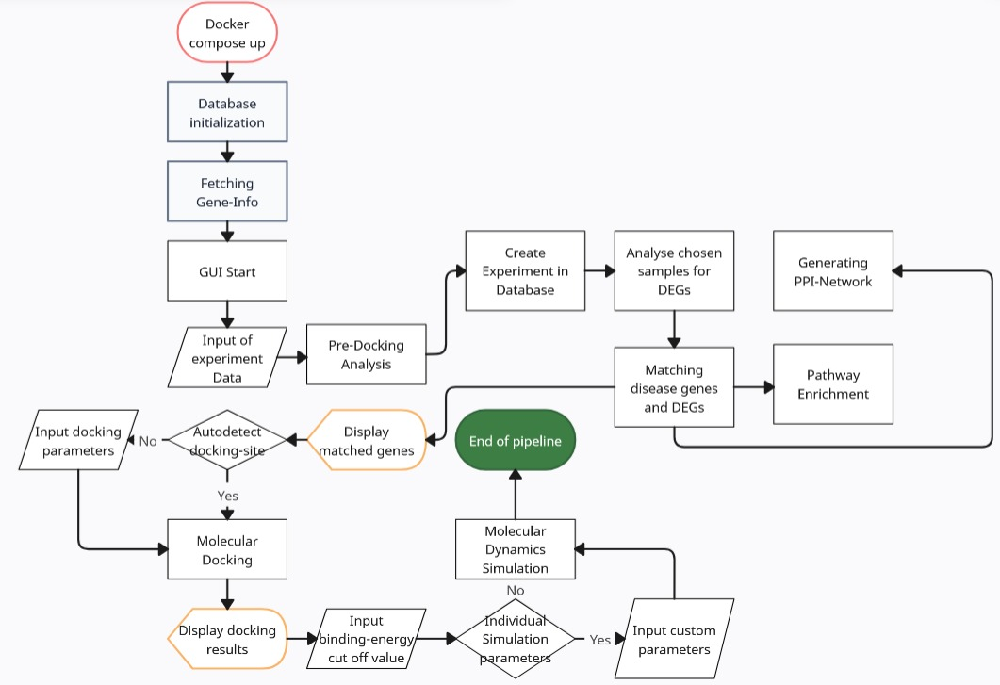
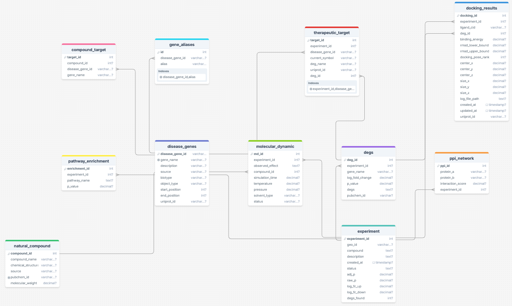

---

# ADHD Compound Pipeline

This project analyzes natural compounds and their relationships to ADHD-related data using various computational tools and workflows. It integrates:

- GEO dataset analysis
- Automated workflows for data extraction, transformation, and analysis
- A **GUI** built with **Streamlit** for user-friendly interactions
- A **PostgreSQL** database for persisting results
- Various scripts in **Python** and **R** (including **Bioconductor** packages)
- **Note**: Altough its presented as an ADHD specific pipeline its easy to switch the target by simply changing the content of the "adhd_disease_genes.txt" file, which will probably be renamed in future iterations.

The pipeline can be run via docker compose or a lot of painful environment magic.

---

## Table of Contents

1. [Project Overview](#project-overview)
2. [Project Structure](#project-structure)
3. [Docker Setup](#docker-setup)
    1. [Prerequisites](#prerequisites)
    2. [Building the Docker Image](#building-the-docker-image)
    3. [Running the Containers](#running-the-containers)
    4. [Accessing the Pipeline and Database](#accessing-the-pipeline-and-database)
    5. [GPU Support](#gpu-support)
    6. [Port Conflicts](#port-conflicts)
    7. [Cleaning Up Docker Resources](#cleaning-up-docker-resources)
    8. [Troubleshooting](#troubleshooting)
4. [Contributing](#contributing)
5. [License](#license)

---

## Project Overview

1. **GEO Dataset Analysis**: Processes GEO Datasets and analyzes changed gene expression based on user defined parameters.
2. **Disease Gene Integration**: Uses a curated list of genes to filter out changes in genes of interest.
3. **Analytic output**: Matches gene expression with known compounds of interest.
4. **Automated Workflows**: Uses Nextflow for reproducible pipelines, plus Python & R scripts.
5. **Streamlit GUI**: A user-friendly interface on port 8501 for launching workflows and viewing results.
6. **PostgreSQL Database**: Stores extensive experiment metadata and results for further processing.
7. **Results**: The results folder contains all the generated graphics, files and Objects for future use.




---

## Project Structure

```plaintext
ADHD_Compound_Pipeline/
├── scripts/             # Python and R scripts for data processing
│   ├── gui_app.py       # Streamlit GUI app
│   ├── etl_script.py    # ETL script for database operations
│   ├── analyze_geo.R    # R script for GEO dataset analysis
│   └── ...
├── data/
│   ├── database_scheme/
│   │   └── dump-adhd_research.sql  # Postgres schema initialization
│   └── ...
├── logs/                # Log files for debugging
├── results/             # Output results from the pipeline
├── renv/                # R's renv folder for Bioconductor/CRAN packages
├── renv.lock            # Lockfile with pinned R packages
├── config.yaml          # Centralized configuration file
├── environment.yml      # Conda environment specification (Python + R + ...
├── nextflow.config      # Nextflow configuration for workflow management
├── Dockerfile           # Docker build file
├── docker-compose.yml   # Docker Compose configuration
├── README.md            # Project documentation
└── ...
```

---

## Docker Setup

For a fully containerized experience, including **PostgreSQL** and all dependencies in one place, use **Docker Compose**.

### Prerequisites

1. **Docker** (>= 20.10)
2. **Docker Compose** (the newer plugin-based version is recommended)
3. **NVIDIA drivers** + **NVIDIA Container Toolkit** if you want GPU acceleration
    - [Install Guide](https://docs.nvidia.com/datacenter/cloud-native/container-toolkit/install-guide.html)

To verify your setup:

```bash
docker --version
docker compose version
nvidia-smi   # if using GPU
```

### Building the Docker Image

1. Clone this repo (if you haven’t already).
2. *(Optional)* Edit `docker-compose.yml` if you need a different host port for Postgres or Streamlit.
3. Build:

   ```bash
   docker compose build
   ```
    - This pulls the **nvidia/cuda** base image, installs **R 4.3+**, **conda**, your environment (`myenv`), **renv**, plus GROMACS with CUDA, etc.

    - If you change your Dockerfile or `environment.yml`, do:
      ```bash
      docker compose build --no-cache
      ```

### Running the Containers

```bash
docker compose up -d
```

This will:

- Start a **db** container (Postgres 15) on port 5432 (unless changed).
- Start an **adhd_pipeline** container that has everything you need:
    - **conda** environment (`myenv`) with your Python tools
    - **R** with Bioconductor packages (managed by `renv`)
    - **GPU-enabled GROMACS** (if you have an NVIDIA GPU)
    - Your code in `/app` or `/workspace` (depending on how you set volumes).

Check logs:

```bash
docker compose logs -f db
docker compose logs -f adhd_pipeline
```

### Accessing the Pipeline and Database

1. **Streamlit**: If the container is set to run `streamlit run scripts/gui_app.py --server.port=8501`, open <http://localhost:8501> to see the GUI.
2. **Postgres**: By default mapped to `db:5432`, user=`postgres`, password=`admin` (or as per `docker-compose.yml`). For example:
   ```bash
   psql -h db -p 5432 -U postgres -d adhd_research
   ```
3. **Inside the pipeline container**:
   ```bash
   docker compose exec adhd_pipeline bash
   ```
    - The conda environment is on `PATH`, so you can directly run `python`, `streamlit`, `nextflow`, etc.

### GPU Support

If you need **GPU-accelerated MD simulations**:

1. Make sure `nvidia-smi` works on your host.
2. In `docker-compose.yml`, add device requests or a deploy block:
   ```yaml
   deploy:
     resources:
       reservations:
         devices:
           - driver: nvidia
             count: 1
             capabilities: [gpu]
   ```
   or
   ```yaml
   device_requests:
     - driver: nvidia
       count: -1
       capabilities: [gpu]
   ```
3. `docker compose up -d`. The container should detect your GPU if everything is set up. Check logs or run:
   ```bash
   docker compose exec adhd_pipeline nvidia-smi
   ```

### Port Conflicts

If you see an error:

```
bind: address already in use
```

- Another service on your host is using port 5432 or 8501.
- Either stop the other service or change the port mapping, e.g.:

```yaml
ports:
  - "65432:5432"
```
Then connect on port **65432** locally.

### Cleaning Up Docker Resources

**Disk usage** can grow quickly with Docker images. To clean up:

1. **Stop** containers:
   ```bash
   docker compose down
   ```
2. **Remove** unused images, containers, networks:
   ```bash
   docker system prune
   ```
   Add `-a` to remove **all** unused images:
   ```bash
   docker system prune -a
   ```
3. **Remove** unused volumes (be cautious if they have important data):
   ```bash
   docker volume prune
   ```
4. **Builder cache**:
   ```bash
   docker builder prune
   ```

### Troubleshooting

1. **Missing system libraries** in build logs:
    - Add them to the `RUN apt-get install` lines in the Dockerfile.
2. **RenV / Bioconductor mismatch**:
    - Make sure your lockfile references R 4.3.x if your Docker uses R 4.3.
    - Re-snapshot locally if you updated packages.
3. **No GPU**:
    - Confirm `nvidia-smi` on host.
    - Double-check device requests in `docker-compose.yml`.
4. **Port collisions**:
    - Stop the conflicting service or change the mapped ports.

---

## Contributing

Feel free to open **issues** or **pull requests** to enhance features, fix bugs, or improve documentation. We welcome community contributions!

---

## License

Not sure what to write here, its my first bigger private project!

---

**Enjoy using the ADHD Compound Pipeline!** For any questions or issues, please reach out or file a GitHub issue.
